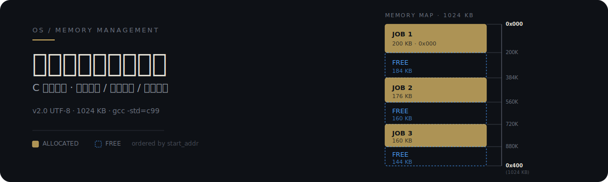

<p align="center">
  
</p>

## 它是什么

用 C 语言实现的操作系统可变式分区存储管理教学项目。在一个 **1024 KB** 的连续内存空间上演示三种经典动态分区分配算法,并解决 Windows 控制台中文 UTF-8 显示乱码问题。同一个作业序列下,三种算法会产生明显不同的碎片分布,可直接对比。

## 三种分配算法

<p align="center">
  
</p>

| 算法 | 选块策略 | 优势 | 代价 |
|------|----------|------|------|
| **First Fit 首次适应** | 从低地址顺序扫描,第一个 `size >= request` 的空闲区即分配 | 分配快,查找开销小 | 低地址端碎片集中 |
| **Best Fit 最佳适应** | 扫描全部空闲区,选满足要求的最小块 | 大块得以保留,空间利用率高 | 易产生不可用小碎片 |
| **Worst Fit 最坏适应** | 扫描全部空闲区,选最大块分配 | 剩余碎片较大,可继续使用 | 大块被迅速消耗 |

上方三张迷你内存条带分别示意每种算法在多个空闲块中的选块位置:First Fit 选最上方第一个够大块,Best Fit 选最小的够大块,Worst Fit 选最大的块。

## 为什么不一样

本项目把"算法差异"做成可观测的内存布局,而不是停留在伪代码层面:

- **分区分割** — 作业请求小于空闲区时,该空闲区被切分为"已分配块 + 剩余空闲块",剩余块保留原起始地址偏移,链表插入新节点。
- **相邻空闲区合并** — 作业释放时,若与上方或下方空闲区物理相邻,自动合并为一个更大的空闲块,避免外部碎片累积。这是三种算法共用的回收逻辑。
- **三算法同构对比** — 同一套 `MemoryBlock` 数据结构与链表遍历骨架,仅替换"选块判定函数",便于在同一基准上横向对比碎片产生情况。

## 工作原理

### 数据结构

```c
typedef struct {
    int start_addr;  /* 起始地址 (KB) */
    int size;        /* 分区大小 (KB) */
    int status;      /* 0 = 空闲, 1 = 已分配 */
    int job_id;      /* 作业 ID,空闲时为 -1 */
} MemoryBlock;
```

每个分区按 `start_addr` 升序组织,分配与回收均在有序链表上进行,合并时只需检查相邻节点。

### 算法核心对比

| 步骤 | First Fit | Best Fit | Worst Fit |
|------|-----------|----------|-----------|
| 1 | 顺序遍历 | 顺序遍历 | 顺序遍历 |
| 2 | 首个 `size >= request` 即停 | 记录所有满足者中的最小 `size` | 记录所有满足者中的最大 `size` |
| 3 | 切分剩余 | 切分剩余 | 切分剩余 |

回收阶段三种算法完全相同:释放节点 → 标记为空闲 → 向上检查相邻 → 向下检查相邻 → 双向合并。

## 如何使用

### 编译

```bash
gcc -Wall -g -std=c99 -o memory_management_utf8.exe memory_management_utf8.c
```

### 首次运行

```bash
.\memory_management_utf8.exe
```

或直接执行批处理脚本:

```bash
.\test_utf8.bat
```

启动后进入交互菜单:**选择算法 → 分配内存 → 回收内存 → 显示当前分区状态**。初始内存总容量固定为 1024 KB,每次操作后都会打印当前分区条带,可直观看到分割与合并。

## 项目结构

| 文件 | 作用 |
|------|------|
| `memory_management_utf8.c` | 主程序源码(UTF-8 中文版) |
| `memory_management_utf8.exe` | 编译产物 |
| `test_utf8.bat` | Windows 一键运行脚本 |
| `实训4实验报告完整版.md` | 完整实验报告 |
| `实验报告.md` | 简版实验报告 |
| `UTF-8版本说明.md` | UTF-8 适配说明 |
| `使用说明.md` | 使用文档 |

## 技术亮点

- **Windows 中文编码适配** — 使用 `SetConsoleOutputCP(65001)` 将控制台输出代码页切换为 UTF-8,根治中文乱码。
- **分区分割与合并** — 分配时按需切分,回收时双向合并相邻空闲区,逻辑独立于选块算法。
- **三算法同构对比** — 同一数据结构下仅替换选块策略,差异直接体现在分区条带输出上。

## 限制与兼容性

- **平台**:Windows(依赖 `SetConsoleOutputCP`,POSIX 平台需替换编码处理)。
- **编译器**:建议 `gcc` 与 `-std=c99`;未在 MSVC 上验证。
- **内存模型**:仅模拟单连续区,不涉及虚拟内存、分页或段页式管理。

## 许可

教学项目,供学习与课堂使用。
