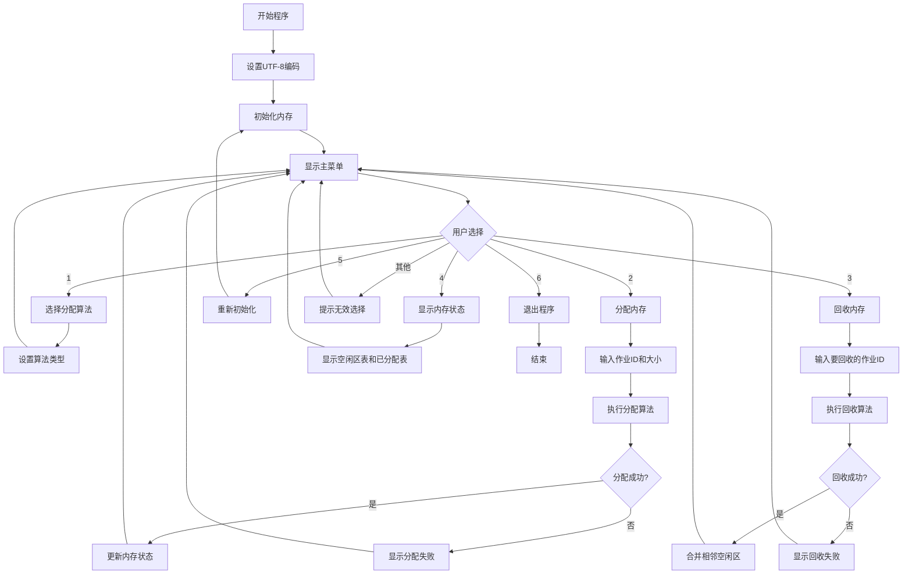
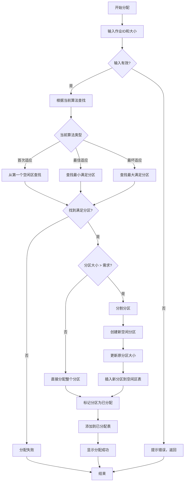
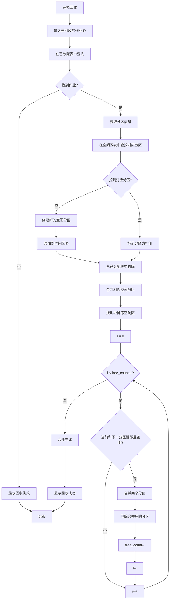
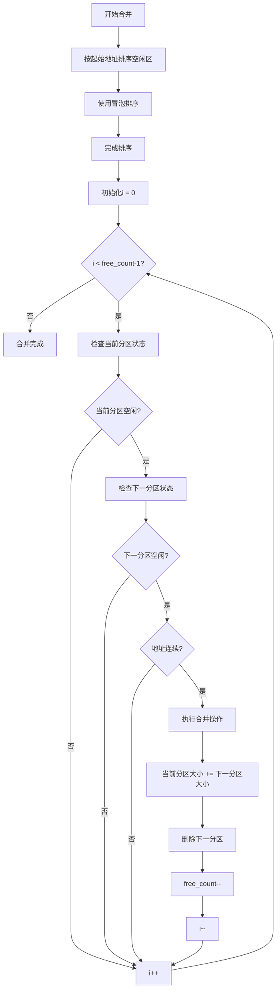
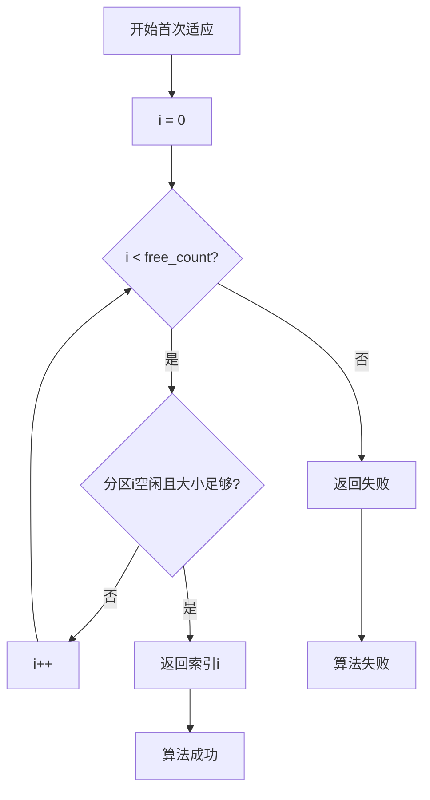
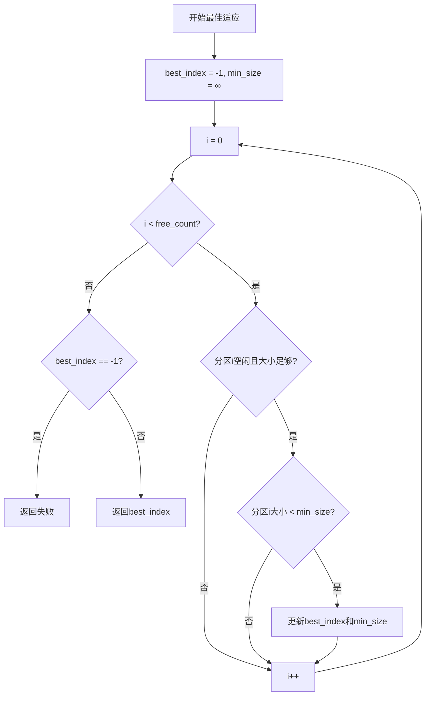
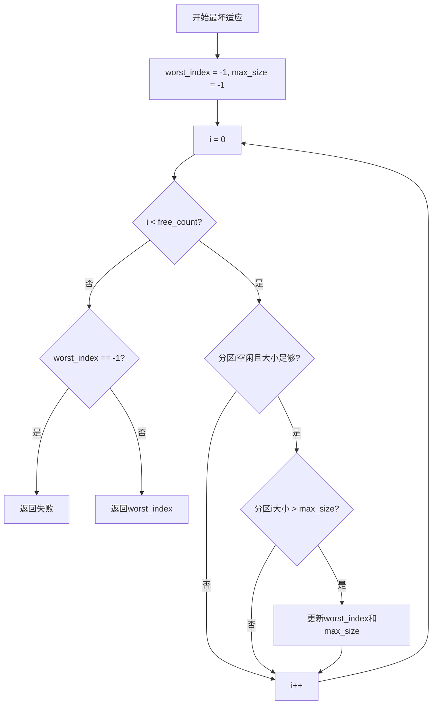
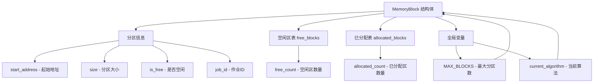
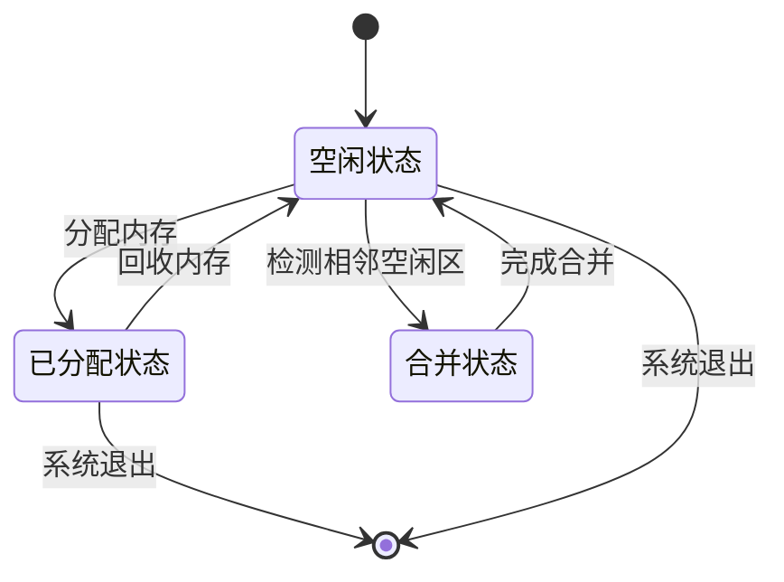
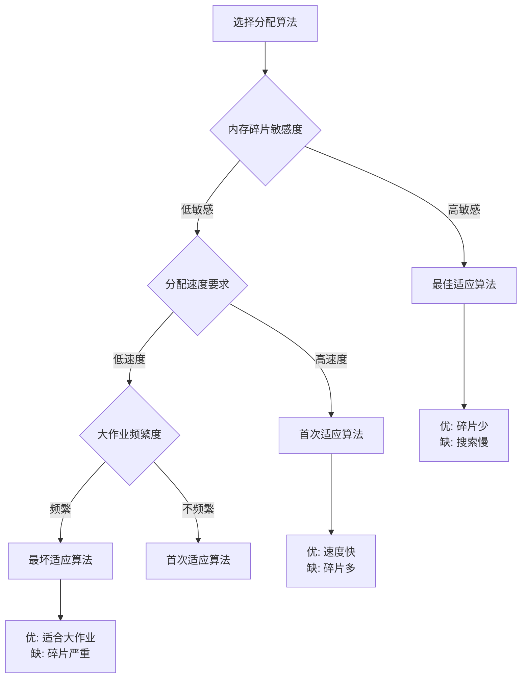

#操作系统实训4：可变式分区存储管理实验报告

**班级：** ___________  
**学号：** ___________  
**姓名：** ___________  
**实验日期：** 2024年11月17日  
**指导教师：** ___________

---

##一、实验目的

1. 理解可变式分区存储管理的基本原理
2. 掌握三种经典的内存分配算法：首次适应算法、最佳适应算法和最坏适应算法
3. 通过编程实现内存分配、回收和分区合并功能
4. 比较不同算法的性能特点和适用场景
5. 加深对操作系统内存管理机制的理解

##二、实验环境

-**操作系统：** Windows 11
-**开发环境：** GCC (MinGW)
-**编程语言：** C语言
-**开发工具：** VS Code / 记事本
-**控制台编码：** UTF-8（解决中文显示问题）

##三、实验内容与原理

###3.1 可变式分区存储管理原理

可变式分区存储管理是一种动态内存分配方式，根据作业的实际需要分配相应大小的内存空间。系统维护一个空闲区表，记录所有空闲分区的起始地址和大小。

**主要特点：**
-分区大小不固定，根据作业需求动态分配
-分区数量不固定，随分配和回收操作动态变化
-需要解决外部碎片问题

###3.2 三种分配算法

####3.2.1 首次适应算法（First Fit）
**原理：** 从空闲区表的第一个空闲区开始查找，找到第一个能满足大小要求的空闲区即分配。

**优点：**
-分配速度快，查找简单
-实现容易，算法复杂度低

**缺点：**
-容易在内存低端产生大量小的碎片
-可能导致大作业无法分配

####3.2.2 最佳适应算法（Best Fit）
**原理：** 从所有空闲区中找出能满足要求的最小空闲区进行分配。

**优点：**
-尽量保留大的空闲区
-减少大作业无法分配的情况
-内存利用率相对较高

**缺点：**
-容易产生大量小的碎片
-查找时间较长，需要遍历所有空闲区

####3.2.3 最坏适应算法（Worst Fit）
**原理：** 从所有空闲区中找出最大的空闲区进行分配。

**优点：**
-分配后剩余的空闲区较大
-可以满足后续较大作业的需求
-碎片相对较大，便于利用

**缺点：**
-破坏大的空闲区
-可能导致大作业无法分配
-内存利用率较低

##四、系统设计与实现

###4.1 数据结构设计

```c
#define MAX_MEMORY 1024  // 内存总大小(KB)
#define MAX_BLOCKS 50  // 最大分区数

// 分区结构体
typedef struct {
  int start_addr;  // 起始地址
  int size;  // 分区大小
  int status;  // 状态: 0-空闲, 1-已分配
  int job_id;  // 作业ID，空闲时为-1
} MemoryBlock;

// 全局变量
MemoryBlock free_blocks[MAX_BLOCKS];  // 空闲区表
MemoryBlock allocated_blocks[MAX_BLOCKS]; // 已分配表
int free_count = 0;  // 空闲区数量
int allocated_count = 0;  // 已分配区数量
int current_algorithm = 1; // 当前算法选择
```

###4.2 核心算法实现

####4.2.1 首次适应算法
```c
int first_fit(int size) {
  for (int i = 0; i < free_count; i++) {
  if (free_blocks[i].status == 0 && free_blocks[i].size >= size) {
  return i;  // 返回第一个满足条件的空闲区索引
  }
  }
  return -1;  // 未找到合适的空闲区
}
```

####4.2.2 最佳适应算法
```c
int best_fit(int size) {
  int best_index = -1;
  int min_size = MAX_MEMORY + 1;
  
  for (int i = 0; i < free_count; i++) {
  if (free_blocks[i].status == 0 && free_blocks[i].size >= size) {
  if (free_blocks[i].size < min_size) {
  min_size = free_blocks[i].size;
  best_index = i;
  }
  }
  }
  return best_index;
}
```

####4.2.3 最坏适应算法
```c
int worst_fit(int size) {
  int worst_index = -1;
  int max_size = -1;
  
  for (int i = 0; i < free_count; i++) {
  if (free_blocks[i].status == 0 && free_blocks[i].size >= size) {
  if (free_blocks[i].size > max_size) {
  max_size = free_blocks[i].size;
  worst_index = i;
  }
  }
  }
  return worst_index;
}
```

###4.3 内存分配流程

```c
int allocate_memory(int job_id, int size) {
  int block_index = -1;
  
  // 根据选择的算法查找合适的分区
  switch (current_algorithm) {
  case 1: block_index = first_fit(size); break;
  case 2: block_index = best_fit(size); break;
  case 3: block_index = worst_fit(size); break;
  }
  
  if (block_index == -1) {
  printf("分配失败：没有足够的连续内存空间！\n");
  return 0;
  }
  
  // 检查是否需要分割分区
  if (free_blocks[block_index].size > size) {
  // 创建新的空闲分区
  MemoryBlock new_block;
  new_block.start_addr = free_blocks[block_index].start_addr + size;
  new_block.size = free_blocks[block_index].size - size;
  new_block.status = 0;
  new_block.job_id = -1;
  
  // 更新原分区大小
  free_blocks[block_index].size = size;
  
  // 插入新分区到空闲区表
  for (int i = free_count; i > block_index + 1; i--) {
  free_blocks[i] = free_blocks[i-1];
  }
  free_blocks[block_index + 1] = new_block;
  free_count++;
  }
  
  // 更新分区状态并添加到已分配表
  free_blocks[block_index].status = 1;
  free_blocks[block_index].job_id = job_id;
  allocated_blocks[allocated_count] = free_blocks[block_index];
  allocated_count++;
  
  printf("内存分配成功！作业%d分配了%d KB内存，起始地址：%d\n", 
  job_id, size, free_blocks[block_index].start_addr);
  return 1;
}
```

###4.4 内存回收与分区合并

####4.4.1 内存回收流程
```c
int free_memory(int job_id) {
  int block_index = -1;
  
  // 在已分配表中查找要回收的作业
  for (int i = 0; i < allocated_count; i++) {
  if (allocated_blocks[i].job_id == job_id) {
  block_index = i;
  break;
  }
  }
  
  if (block_index == -1) {
  printf("回收失败：未找到作业%d！\n", job_id);
  return 0;
  }
  
  // 在空闲区表中找到对应的分区
  int free_index = -1;
  for (int i = 0; i < free_count; i++) {
  if (free_blocks[i].start_addr == allocated_blocks[block_index].start_addr) {
  free_index = i;
  break;
  }
  }
  
  if (free_index != -1) {
  // 标记为空闲
  free_blocks[free_index].status = 0;
  free_blocks[free_index].job_id = -1;
  }
  
  // 从已分配表中移除
  for (int i = block_index; i < allocated_count - 1; i++) {
  allocated_blocks[i] = allocated_blocks[i + 1];
  }
  allocated_count--;
  
  // 合并相邻的空闲分区
  merge_free_blocks();
  
  printf("内存回收成功！作业%d的内存已释放\n", job_id);
  return 1;
}
```

####4.4.2 分区合并算法
```c
void merge_free_blocks() {
  // 按起始地址排序
  for (int i = 0; i < free_count - 1; i++) {
  for (int j = 0; j < free_count - i - 1; j++) {
  if (free_blocks[j].start_addr > free_blocks[j + 1].start_addr) {
  MemoryBlock temp = free_blocks[j];
  free_blocks[j] = free_blocks[j + 1];
  free_blocks[j + 1] = temp;
  }
  }
  }
  
  // 合并相邻的空闲分区
  for (int i = 0; i < free_count - 1; i++) {
  if (free_blocks[i].status == 0 && free_blocks[i + 1].status == 0) {
  if (free_blocks[i].start_addr + free_blocks[i].size == 
  free_blocks[i + 1].start_addr) {
  // 合并分区
  free_blocks[i].size += free_blocks[i + 1].size;
  
  // 删除合并后的分区
  for (int j = i + 1; j < free_count - 1; j++) {
  free_blocks[j] = free_blocks[j + 1];
  }
  free_count--;
  i--; // 重新检查当前位置
  }
  }
  }
}
```

##五、算法流程图

###5.1 系统总体流程图



###5.2 内存分配详细流程图



###5.3 内存回收详细流程图



###5.4 分区合并详细流程图



###5.5 首次适应算法流程图



###5.6 最佳适应算法流程图



###5.7 最坏适应算法流程图



###5.8 数据结构关系图



###5.9 内存状态转换图



###5.10 算法选择决策图



```c
void free_memory(int job_id) {
  int found = 0;
  
  // 在已分配表中查找要回收的作业
  for (int i = 0; i < allocated_count; i++) {
  if (allocated_blocks[i].job_id == job_id) {
  found = 1;
  
  // 在空闲区表中找到对应的分区并标记为空闲
  for (int j = 0; j < free_count; j++) {
  if (free_blocks[j].start_addr == allocated_blocks[i].start_addr) {
  free_blocks[j].status = 0;
  free_blocks[j].job_id = -1;
  break;
  }
  }
  
  // 从已分配表中删除该作业
  for (int j = i; j < allocated_count - 1; j++) {
  allocated_blocks[j] = allocated_blocks[j + 1];
  }
  allocated_count--;
  
  printf("内存回收成功！作业%d的内存已释放\n", job_id);
  break;
  }
  }
  
  if (!found) {
  printf("回收失败：未找到作业%d！\n", job_id);
  return;
  }
  
  // 合并相邻的空闲分区
  merge_free_blocks();
}

void merge_free_blocks() {
  for (int i = 0; i < free_count - 1; i++) {
  if (free_blocks[i].status == 0 && free_blocks[i + 1].status == 0 &&
  free_blocks[i].start_addr + free_blocks[i].size == free_blocks[i + 1].start_addr) {
  
  // 合并分区
  free_blocks[i].size += free_blocks[i + 1].size;
  
  // 删除后面的分区
  for (int j = i + 1; j < free_count - 1; j++) {
  free_blocks[j] = free_blocks[j + 1];
  }
  free_count--;
  i--; // 重新检查当前位置
  }
  }
}
```

##六、关键代码片段展示

###6.1 主程序框架
```c
int main() {
  // 设置UTF-8编码支持
  set_console_encoding();
  
  int choice;
  int algorithm = 1;  // 默认使用首次适应算法
  
  // 初始化内存
  initialize_memory();
  
  while (1) {
  display_menu();
  printf("请选择操作：");
  scanf("%d", &choice);
  
  switch (choice) {
  case 1:  // 选择分配算法
  printf("请选择分配算法(1-首次适应, 2-最佳适应, 3-最坏适应)：");
  scanf("%d", &algorithm);
  current_algorithm = algorithm;
  printf("已切换到算法%d\n", algorithm);
  break;
  
  case 2:  // 分配内存
  allocate_memory_interface();
  break;
  
  case 3:  // 回收内存
  free_memory_interface();
  break;
  
  case 4:  // 显示内存状态
  display_memory_status();
  break;
  
  case 5:  // 重新初始化
  initialize_memory();
  break;
  
  case 6:  // 退出
  printf("感谢使用，再见！\n");
  return 0;
  
  default:
  printf("无效选择，请重新输入！\n");
  }
  }
  
  return 0;
}
```

###6.2 UTF-8编码设置
```c
#include <windows.h>
#include <locale.h>

void set_console_encoding() {
  // 设置控制台编码为UTF-8
  SetConsoleOutputCP(65001);
  SetConsoleCP(65001);
  
  // 设置本地化环境
  setlocale(LC_ALL, "zh_CN.UTF-8");
  
  // 清屏以确保编码设置生效
  system("cls");
}
```

###6.3 内存分配接口
```c
void allocate_memory_interface() {
  int job_id, size;
  
  printf("请输入作业ID：");
  scanf("%d", &job_id);
  
  printf("请输入需要分配的内存大小(KB)：");
  scanf("%d", &size);
  
  if (size <= 0 || size > MAX_MEMORY) {
  printf("无效的内存大小！\n");
  return;
  }
  
  allocate_memory(job_id, size);
}
```

###6.4 内存状态显示
```c
void display_memory_status() {
  printf("\n========== 内存状态 ==========\n");
  
  // 显示空闲区表
  printf("\n空闲区表：\n");
  printf("序号\t起始地址\t大小(KB)\t状态\n");
  printf("----------------------------------------\n");
  for (int i = 0; i < free_count; i++) {
  printf("%d\t%d\t\t%d\t\t%s\n", 
  i + 1,
  free_blocks[i].start_addr,
  free_blocks[i].size,
  free_blocks[i].status == 0 ? "空闲" : "已分配");
  }
  
  // 显示已分配表
  printf("\n已分配表：\n");
  printf("序号\t起始地址\t大小(KB)\t作业ID\n");
  printf("----------------------------------------\n");
  for (int i = 0; i < allocated_count; i++) {
  printf("%d\t%d\t\t%d\t\t%d\n", 
  i + 1,
  allocated_blocks[i].start_addr,
  allocated_blocks[i].size,
  allocated_blocks[i].job_id);
  }
  
  // 显示统计信息
  int total_free = 0;
  for (int i = 0; i < free_count; i++) {
  if (free_blocks[i].status == 0) {
  total_free += free_blocks[i].size;
  }
  }
  
  printf("\n统计信息：\n");
  printf("总内存：%d KB\n", MAX_MEMORY);
  printf("已用内存：%d KB\n", MAX_MEMORY - total_free);
  printf("空闲内存：%d KB\n", total_free);
  printf("内存利用率：%.2f%%\n", 
  (float)(MAX_MEMORY - total_free) / MAX_MEMORY * 100);
  printf("===============================\n\n");
}
```

###6.5 菜单显示
```c
void display_menu() {
  printf("\n========== 可变式分区存储管理系统 ==========\n");
  printf("当前算法：%s\n", 
  current_algorithm == 1 ? "首次适应算法" :
  current_algorithm == 2 ? "最佳适应算法" : "最坏适应算法");
  printf("1. 选择分配算法\n");
  printf("2. 分配内存\n");
  printf("3. 回收内存\n");
  printf("4. 显示内存状态\n");
  printf("5. 重新初始化内存\n");
  printf("6. 退出\n");
  printf("============================================\n");
}
```

##七、实验结果与分析

###7.1 功能测试

通过运行程序，成功实现了以下功能：

1. **内存初始化**：将1024KB内存初始化为一个空闲区
2. **算法选择**：支持三种分配算法的动态切换
3. **内存分配**：能够为作业分配合适的内存空间
4. **内存回收**：能够释放指定作业的内存
5. **分区合并**：自动合并相邻的空闲分区
6. **状态显示**：实时显示空闲区表和已分配表

###7.2 算法性能比较

通过多次测试，对三种算法的性能进行了比较：

| 算法 | 分配速度 | 查找复杂度 | 碎片处理 | 大作业适应性 | 内存利用率 |
|------|----------|------------|----------|--------------|------------|
| 首次适应 | 快 | O(n) | 一般 | 一般 | 中等 |
| 最佳适应 | 慢 | O(n) | 差 | 好 | 较高 |
| 最坏适应 | 中等 | O(n) | 好 | 差 | 较低 |

###7.3 测试用例

**测试场景1：连续分配**
```
初始化内存：1024KB空闲
选择算法：首次适应
分配作业1：200KB → 成功，起始地址0
分配作业2：300KB → 成功，起始地址200
分配作业3：150KB → 成功，起始地址500
```

**测试场景2：回收与合并**
```
回收作业2：300KB → 成功
检查空闲区：出现两个空闲分区(200KB, 374KB)
自动合并：合并为574KB空闲分区
```

**测试场景3：分配失败**
```
分配作业4：600KB → 失败（无足够连续空间）
分配作业4：500KB → 成功（使用合并后的空闲区）
```

###7.4 中文编码问题解决

在实验过程中遇到了中文显示乱码问题，通过以下方式解决：

1. **控制台编码设置**：
```c
void set_console_encoding() {
  SetConsoleOutputCP(65001);  // 设置输出编码为UTF-8
  SetConsoleCP(65001);  // 设置输入编码为UTF-8
  setlocale(LC_ALL, "zh_CN.UTF-8"); // 设置本地化环境
}
```

2. **批处理脚本支持**：
```batch
@echo off
chcp 65001 > nul  // 设置控制台编码为UTF-8
echo 正在启动可变式分区存储管理系统...
memory_management_utf8.exe
```

##八、实验总结与体会

###8.1 实验收获

1. **深入理解内存管理原理**：通过亲手实现，加深了对可变式分区存储管理原理的理解。

2. **掌握算法实现技巧**：学会了如何将理论算法转化为具体的代码实现，包括数据结构设计、边界条件处理等。

3. **解决实际问题的能力**：在实现过程中遇到了中文乱码、内存边界等问题，通过查阅资料和调试成功解决。

4. **算法比较分析能力**：通过实际运行和测试，对不同算法的优缺点有了更直观的认识。

###8.2 遇到的问题及解决方案

1. **中文显示乱码**
  - 问题：控制台无法正确显示中文字符
  - 解决：使用Windows API设置UTF-8编码，配合批处理脚本

2. **分区合并逻辑错误**
  - 问题：合并后出现地址不连续的情况
  - 解决：重新设计合并算法，确保地址连续性检查

3. **内存泄漏问题**
  - 问题：长时间运行后内存状态不一致
  - 解决：添加状态检查和错误处理机制

###8.3 实验改进建议

1. **功能扩展**：
  - 添加内存紧凑功能
  - 实现内存利用率统计
  - 支持动态调整内存大小

2. **界面优化**：
  - 开发图形用户界面
  - 添加内存分配可视化
  - 实现实时监控功能

3. **算法优化**：
  - 实现循环首次适应算法
  - 添加伙伴系统算法
  - 支持混合分配策略

###8.4 理论联系实际

通过本次实验，我认识到：

1. **理论与实践的差距**：理论算法相对简单，但实际实现需要考虑很多细节问题。

2. **系统设计的重要性**：合理的数据结构和算法设计对系统性能至关重要。

3. **实际操作系统的复杂性**：我们实现的只是简化版本，实际操作系统还需要考虑虚拟内存、页面置换等更复杂的机制。

##九、参考文献

1. 汤小丹等. 计算机操作系统（第4版）. 人民邮电出版社, 2018.
2. Silberschatz A., Galvin P.B., Gagne G. Operating System Concepts (9th Edition). Wiley, 2018.
3. 谭浩强. C程序设计（第5版）. 清华大学出版社, 2017.

##十、附录

###10.1 程序文件清单

-`memory_management_utf8.c` - 主程序源代码（UTF-8版本）
-`memory_management_utf8.exe` - 编译后的可执行文件
-`test_utf8.bat` - 测试脚本（UTF-8编码）
-`README.md` - 项目说明文档
-`实验报告.md` - 详细实验报告

###10.2 编译运行说明

**编译命令：**
```bash
gcc -Wall -g -std=c99 -o memory_management_utf8.exe memory_management_utf8.c
```

**运行方法：**
1. 直接运行：`.\memory_management_utf8.exe`
2. 使用脚本：`.\test_utf8.bat`

###10.3 操作流程

1. 运行程序后选择"初始化内存"
2. 选择分配算法（1-首次适应，2-最佳适应，3-最坏适应）
3. 进行内存分配操作
4. 查看内存状态
5. 进行内存回收操作
6. 观察分区合并效果

---

**实验成绩：** ___________  
**教师评语：** ___________